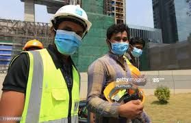
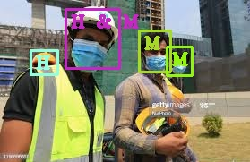
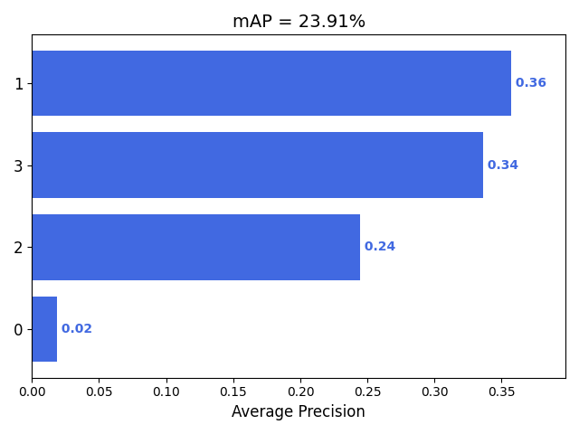

# Mask & Helmet Detection using Yolo #

* Used yolov3 for multiple object detection. The biggest advantage of using YOLO is its superb speed – it's incredibly fast. 

* Classes name :- F(Face),H & M (Helmet & Mask), M (Mask) ,H (Helmet)

## Requiremets #
```
pip install -r requirements.txt
```

## Steps for object detection #
* Step 1:-
Converting xml to YoloV3 format
```
python3 custom_data/ground_truth_data_generator.py
```

* Step 2:-
Train and Test (80:20)
```
python3 custom_data/train_test.py
```

* Step 3:-
Training using darknet
```
./darknet detector train custom_data/detector.data custom_data/yolov3-tiny-custom.cfg darknet53.conv.74
```

* Step 4:-
Test Inference
```
python3 custom_data/test_inference.py --config yolov3-tiny-custom.cfg --weights ../backup/yolov3-tiny-custom_30000.weights --names custom.names
 ```

* Step 5:-
For balancing count of images having ground-truth
```
python3 scripts/extra/intersect-gt-and-dr.py
```

* Step 6:-
Calculating mAp on test data
```
python3 custom_data/mAp_calculator.py
```

* For testing on real image
```
python3 custom_data/detection.py
```




* Result Plots 
```
custom_data/output
```

